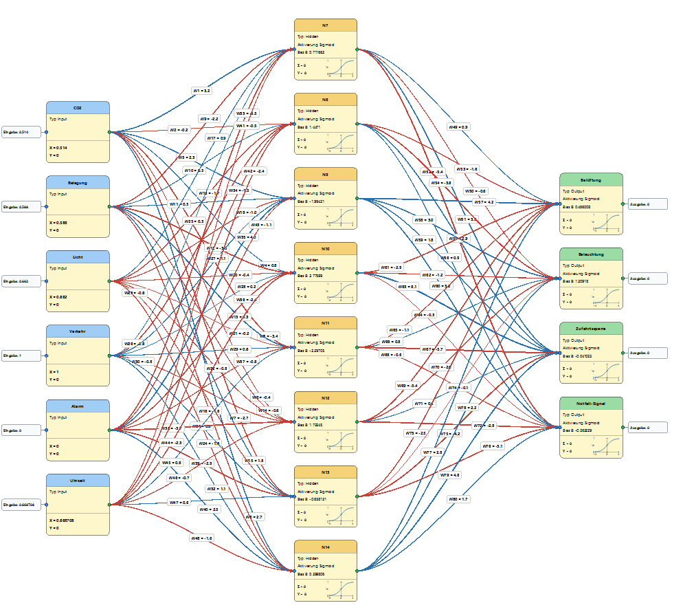

# NeuronNetz

[English](#english-version) | [Deutsch](#deutsche-version)

**Current version / Aktuelle Version:** `0.10.0-beta.03`\
[Download the latest Windows release / Aktuelle Windows-Version herunterladen](https://github.com/hf54de/Neura-Network-Public/releases/latest)

> **Project status:** Public beta. NeuronNetz is a personal
> learning and experimentation project and is not developed as a commercial product.
> Feedback and reproducible bug reports
> are welcome; continuous maintenance or individual support cannot be
> guaranteed.

> **Projektstatus:** Öffentliche Beta-Version. NeuronNetz ist ein persönliches
> Lern- und Experimentierprojekt und wird nicht als kommerzielles Produkt
> entwickelt. Rückmeldungen und
> nachvollziehbare Fehlermeldungen sind willkommen; eine dauerhafte Pflege oder
> individuelle Unterstützung kann nicht zugesagt werden.

---

## English Version

### Graphical Editor for Neural Networks

**NeuronNetz** is designed for graphically creating, editing, training, and testing small neural networks. The program combines practical work with neural networks with a clear representation of their structure and mathematical processes.

### Quick Start

1. Open the [latest release](https://github.com/hf54de/Neura-Network-Public/releases/latest)
   and download `NeuronNetz-...-Windows.zip`. The version number is part of
   the file name.
2. Extract the complete archive into a folder of your choice. Do not start the
   program directly from inside the ZIP archive.
3. Start `NeuronNetz.exe`.
4. Open one of the included example projects or create a new project.

Python and PySide6 do not need to be installed for the packaged Windows
version. Keep the supplied `Projects_de`, `Projects_en`, and `Tutorials`
folders next to the EXE so that examples and documentation can be found.

### System Requirements

Development and source execution were tested with **Python 3.14.7 (64-bit)**,
**PySide6 6.11.1**, and **PyInstaller 6.21.0** (14 September 2026).
This describes the tested environment, not a minimum Python version.
The About dialog automatically displays the Python runtime actually in use;
an existing EXE retains its bundled runtime until it is rebuilt.

- 64-bit Windows
- A display resolution of at least 1366 × 768 is recommended
- Sufficient memory and processing time for the selected network size
- No internet connection is required for normal use

The current executable is not digitally signed. Windows SmartScreen or an
antivirus product may therefore warn about an unknown publisher or quarantine
a newly created release. Only download NeuronNetz from a source you trust,
verify the archive if checksums are supplied, and inspect the published source
code when in doubt.

### Purpose and Basic Concept

NeuronNetz allows neural networks to be created directly on a graphical canvas. Input, hidden, and output neurons are shown as clear visual elements; connections display their weights and the direction of information flow. Names, neuron types, activation functions, positions, and other properties can be edited directly.

A network can be drawn freely, generated automatically from a specified layer structure, or derived from the structure of existing training data. This makes the program suitable both for small experimental setups and for clearly structured practical applications.

### Program Capabilities

| Functional Area | Capabilities |
| :--- | :--- |
| **Network Design** | Create neurons and connections manually or generate complete layered networks automatically. |
| **Training Data** | Enter data, paste it from the clipboard, or import it as CSV; assign columns to neurons and scale values automatically. |
| **Training** | Optimize weights and bias values using an adjustable learning rate, momentum, error limit, and number of epochs; initialize weights automatically with He for ReLU and Xavier/Glorot for Sigmoid, Tanh, and Linear. |
| **Evaluation** | Evaluate the trained network using training data or independent test data without changing its parameters. |
| **Forward Calculation** | Enter custom input values in their original units and immediately observe the resulting outputs. |
| **Training History** | Compare multiple training runs, settings, and error curves, and restore suitable network states. |
| **Result Analysis** | Compare target and calculated values, inspect the largest deviations, apply output-specific tolerances, and examine input influence. |
| **Application View** | Build a freely designed application-oriented view with interactive inputs, outputs, binary input arrays, images, labels, shapes, and a simplified live network display. |
| **PLC Export (Experimental)** | Export a trained network using individual variables: Mitsubishi-specific ASC for GX Works2/3, manufacturer-neutral IEC 61131-10 XML, or a separate GX Works3 XML transfer profile. |
| **Project Assistant** | Prepare an editable prompt for an external AI to develop a project idea, propose a network structure, and generate clearly formatted training data. |
| **Documentation** | Store formatted project notes and export project and training reports. |

### Understanding, Not Just Calculating

A distinctive feature of NeuronNetz is the visible link between the network representation and its calculations. Neurons can display values such as the input, weighted sum, and output. Colors and line widths make the direction and significance of the weights recognizable.

The guided mathematics mode breaks down a complete learning step into clear sections: starting values, input and target values, weighted sum, activation, error and delta, momentum contribution, and the resulting new parameters. A selected input, hidden, or output neuron can be examined individually. The experiment uses a separate copy of the network and does not modify the saved project.

Training runs can be repeated with the same start conditions. NeuronNetz then
reuses the initial weights and bias values together with the training-data
order, making the effect of changed learning parameters directly comparable.

### Application View

The Application View connects a trained network with a practical scenario.
Inputs can be changed directly while output bars, switches, indicators, and a
simplified live network display show the reaction immediately. Cards can be
moved, resized, colored, and arranged on a project-specific canvas. Background
images, comments, lines, curves, arrows, rectangles, and circles can be added
to explain the application. The complete layout is stored with the project.

### Experimental PLC Export

NeuronNetz generates the declarations and forward-calculation code of a trained
network exclusively with the transparent, practically tested
**individual-variable structure**. The separate ASC exports for
**Mitsubishi GX Works2** and **Mitsubishi GX Works3** use dedicated adapters for
their different declaration layouts, clipboard formats, and
exponential-function syntax. The additional **IEC 61131-10 XML** export uses a
dedicated manufacturer-neutral IEC generator and contains neither Mitsubishi
designations nor GX Works-specific function calls. The completeness of an IEC
61131-10 import must be verified in the respective target system. A separate
**Mitsubishi GX Works3 – XML** command keeps the individual-variable layout but
stores variable comments in GX Works3's `AddData/VariableComments` structure;
general comment No. 1 is used so that they appear in the normal comment column.
The neutral XML output remains unchanged.

For the transparent ASC transfer:

1. Create an empty function block in the Mitsubishi project.
2. Copy the generated declarations from NeuronNetz into the local-label table.
3. Copy the generated Structured Text into the empty program body.
4. Compile, inspect, and test the function block in the PLC environment.

Numeric signals are transferred as `REAL` and recognized by Mitsubishi as
**FLOAT (Single Precision)**. Binary signals use `BOOL` and are recognized as
**Bit**. Scaling values, trained weights, biases, and the complete forward
calculation are included. The export changes neither the trained network nor
its project data.

The export windows keep declarations, Structured Text, and XML read-only.
Block name, model version, and additional connections remain configurable;
NeuronNetz immediately regenerates the preview and all generated output.
Optional connections provide enable control, input-range checking, diagnostics,
fallback values, and retention of the last outputs. Complete ASC and XML files
can be saved directly, and the generated content can be copied to the
clipboard. Any required manual code changes should be made after export in the
target engineering environment or an external editor.

Enable the feature under **Settings → Program Settings → Experimental → Show
PLC Export in the menu bar**. CODESYS, TwinCAT, and Siemens SCL are shown as
planned targets but are not yet implemented or validated.

### Projects and Documentation

The network, its visual presentation, training history, and project settings are stored together in a project file. Training and test data, exports, and the Application View are managed in a structured project folder. A formatted project description can also be added. This allows the purpose, structure, and special features of a project to be documented directly alongside the network.

German and English example projects are supplied separately in `Projects_de`
and `Projects_en`. The active project folder can be selected in the program
settings independently of the interface language.

### Target Audience and Applications

NeuronNetz is intended for beginners, learners, educators, and technically interested users who want to explore neural networks as more than an abstract formula or software library. It is also suitable for developers and users who want to build, examine, and clearly present small models quickly.

The program is deliberately designed as a learning and experimentation tool for small, manageable networks. It does not replace industrial machine-learning platforms, but it provides a direct, transparent, and largely intuitive way of working.

### Important Limitations and Disclaimer

- NeuronNetz is intended for learning, demonstration, and experimentation.
- It is not a replacement for established machine-learning frameworks or a
  certified engineering tool.
- Example projects describing buildings, machines, alarms, or control systems
  are demonstrations only. They must not be used directly for real control,
  safety, emergency, medical, or other critical applications.
- Generated PLC code must be reviewed, compiled, simulated, and validated in
  the target engineering environment before use. The experimental export is
  not certified for safety-related or unattended production control.
- Results depend on the data, scaling, network structure, initialization, and
  training settings. Plausibility and suitability must always be checked by
  the user.
- The software is provided without warranty. Back up important projects and
  data before testing a new version.

### Source Code, License, and Contributions

NeuronNetz is free software licensed under the **GNU General Public License,
version 3.0 (GPL-3.0-only)**. The source code may be used, studied, modified,
and redistributed under the conditions stated in the `LICENSE` file in this
repository. Distributed modified versions must also remain available under
the GPL. Copyright © 2026 Helwig Fülling.

When reporting a problem, please include the NeuronNetz version, the steps
needed to reproduce it, the expected result, and—where possible—a small sample
project. Contributions may be reviewed, but acceptance and response times
cannot be guaranteed.

> *In short: NeuronNetz makes the structure, training, and behavior of a neural network visible. It combines graphical work, practical experimentation, and mathematical understanding in a single tool.*

---

## Deutsche Version

### Grafischer Editor für neuronale Netzwerke

**NeuronNetz** dient dazu, kleine neuronale Netzwerke grafisch zu erstellen, zu bearbeiten, zu trainieren und zu testen. Das Programm verbindet die praktische Arbeit mit neuronalen Netzen mit einer anschaulichen Darstellung ihrer Struktur und mathematischen Abläufe.

### Schnellstart

1. Die [aktuelle Veröffentlichung](https://github.com/hf54de/Neura-Network-Public/releases/latest)
   öffnen und `NeuronNetz-...-Windows.zip` herunterladen. Die Versionsnummer
   ist Bestandteil des Dateinamens.
2. Das vollständige Archiv in einen Ordner eigener Wahl entpacken. Das Programm
   nicht direkt aus dem geöffneten ZIP-Archiv starten.
3. `NeuronNetz.exe` starten.
4. Eines der mitgelieferten Beispielprojekte öffnen oder ein neues Projekt
   anlegen.

Für die gepackte Windows-Version müssen Python und PySide6 nicht installiert
sein. Die mitgelieferten Ordner `Projects_de`, `Projects_en` und `Tutorials`
sollten neben der EXE erhalten bleiben, damit Beispiele und Dokumentation
gefunden werden.

### Systemanforderungen

Entwicklung und Ausführung aus dem Quellcode wurden mit **Python 3.14.7 (64-Bit)**,
**PySide6 6.11.1** und **PyInstaller 6.21.0** getestet (14. September 2026).
Dies beschreibt die getestete Umgebung, keine Python-Mindestversion.
Das „Über“-Fenster zeigt automatisch die tatsächlich verwendete Python-Laufzeit;
eine bestehende EXE behält ihre eingebettete Laufzeit bis zum nächsten Neubau.

- 64-Bit-Windows
- Eine Bildschirmauflösung von mindestens 1366 × 768 wird empfohlen
- Ausreichend Arbeitsspeicher und Rechenzeit für die gewählte Netzwerkgröße
- Für die normale Verwendung ist keine Internetverbindung erforderlich

Die aktuelle EXE ist nicht digital signiert. Windows SmartScreen oder ein
Virenscanner kann deshalb vor einem unbekannten Herausgeber warnen oder eine
neu erstellte Version vorsorglich in Quarantäne verschieben. NeuronNetz sollte
nur aus einer vertrauenswürdigen Quelle geladen werden. Sind Prüfsummen
angegeben, sollten diese kontrolliert werden; im Zweifel kann zusätzlich der
veröffentlichte Quellcode geprüft werden.

### Zweck und Grundidee

NeuronNetz ermöglicht den Aufbau neuronaler Netzwerke direkt auf einer grafischen Zeichenfläche. Input-, Hidden- und Output-Neuronen werden als übersichtliche Elemente dargestellt; Verbindungen zeigen ihre Gewichte und die Richtung des Informationsflusses. Namen, Neuron-Typen, Aktivierungsfunktionen, Positionen und weitere Eigenschaften können unmittelbar bearbeitet werden.

Ein Netzwerk kann frei gezeichnet, aus einer vorgegebenen Schichtenstruktur automatisch erzeugt oder aus der Struktur vorhandener Trainingsdaten abgeleitet werden. Dadurch eignet sich das Programm sowohl für kleine Versuchsaufbauten als auch für übersichtlich strukturierte praktische Anwendungen.

### Möglichkeiten des Programms

| Funktionsbereich | Möglichkeiten |
| :--- | :--- |
| **Netzwerkaufbau** | Neuronen und Verbindungen manuell anlegen oder vollständige Schichtnetze automatisch erzeugen. |
| **Trainingsdaten** | Daten eingeben, aus der Zwischenablage übernehmen oder als CSV importieren; Spalten Neuronen zuordnen und Werte automatisch skalieren. |
| **Training** | Gewichte und Bias-Werte mit einstellbarer Lernrate, Momentum, Fehlergrenze und Epochenzahl optimieren; Gewichte automatisch mit He für ReLU und Xavier/Glorot für Sigmoid, Tanh und Linear initialisieren. |
| **Prüfung** | Das gelernte Netzwerk mit Trainings- oder unabhängigen Testdaten berechnen, ohne die Parameter weiter zu verändern. |
| **Vorwärtsberechnung** | Eigene Eingangswerte in ihren ursprünglichen Einheiten eingeben und die resultierenden Ausgaben sofort beobachten. |
| **Trainingshistorie** | Mehrere Trainingsläufe, Einstellungen und Fehlerkurven miteinander vergleichen und geeignete Netzwerkzustände wiederherstellen. |
| **Ergebnisanalyse** | Soll- und Istwerte vergleichen, größte Abweichungen untersuchen, Output-spezifische Toleranzen anwenden und den Einfluss der Eingänge betrachten. |
| **Anwendungsansicht** | Eine frei gestaltbare Anwendungsdarstellung mit interaktiven Eingängen, Ausgängen, binärer Eingabematrix, Bildern, Beschriftungen, Formen und vereinfachter Live-Netzwerkanzeige aufbauen. |
| **SPS-Export (experimentell)** | Ein trainiertes Netz im geprüften Einzelvariablenaufbau exportieren: Mitsubishi-spezifisches ASC für GX Works2/3 oder herstellerneutrales IEC-61131-10-XML. |
| **Projektassistent** | Einen bearbeitbaren Prompt für eine externe KI vorbereiten, um eine Projektidee auszuarbeiten, eine Netzstruktur vorzuschlagen und sauber formatierte Trainingsdaten zu erzeugen. |
| **Dokumentation** | Formatierte Projekthinweise speichern und Projekt- sowie Trainingsberichte exportieren. |

### Verstehen statt nur berechnen

Eine Besonderheit von NeuronNetz ist die sichtbare Verbindung zwischen Netzwerkdarstellung und Berechnung. In den Neuronen können unter anderem Eingangswert, gewichtete Summe und Ausgangswert angezeigt werden. Farben und Linienstärken machen Richtung und Bedeutung der Gewichte erkennbar.

Der geführte Mathematikmodus zerlegt einen vollständigen Lernschritt in nachvollziehbare Abschnitte: Startwerte, Eingangs- und Sollwerte, gewichtete Summe, Aktivierung, Fehler und Delta, Momentumanteil sowie die daraus entstehenden neuen Parameter. Ein ausgewähltes Input-, Hidden- oder Output-Neuron kann dabei gezielt betrachtet werden. Das Experiment arbeitet mit einer getrennten Kopie des Netzwerks und verändert das gespeicherte Projekt nicht.

Trainingsläufe lassen sich mit denselben Startbedingungen wiederholen. Dabei
übernimmt NeuronNetz die anfänglichen Gewichte und Bias-Werte zusammen mit der
Reihenfolge der Trainingsdaten. So kann die Wirkung geänderter Lernparameter
direkt verglichen werden.

### Anwendungsansicht

Die Anwendungsansicht stellt ein trainiertes Netzwerk im Zusammenhang mit
einer praktischen Aufgabe dar. Eingänge können unmittelbar verändert werden;
Ausgabebalken, Schalter, Anzeigen und eine vereinfachte Live-Netzwerkdarstellung
zeigen die Reaktion sofort. Kacheln lassen sich auf einer projektbezogenen
Zeichenfläche verschieben, skalieren, einfärben und anordnen. Hintergrundbilder,
Kommentare, Linien, Kurven, Pfeile, Rechtecke und Kreise erläutern den
Anwendungsfall. Die vollständige Gestaltung wird mit dem Projekt gespeichert.

### Experimenteller SPS-Export

NeuronNetz erzeugt Deklarationen und Vorwärtsberechnung eines trainierten Netzes
ausschließlich im transparenten und praktisch geprüften
**Einzelvariablenaufbau**. Die getrennten ASC-Exporte für
**Mitsubishi GX Works2** und **Mitsubishi GX Works3** berücksichtigen mit eigenen
Adaptern die unterschiedlichen Deklarationstabellen, Zwischenablageformate und
Schreibweisen der Exponentialfunktion. Der zusätzliche Export
**IEC 61131-10 XML** verwendet einen eigenen herstellerneutralen IEC-Generator
und enthält weder Mitsubishi-Bezeichnungen noch GX-Works-spezifische
Funktionsaufrufe. Wie vollständig eine Entwicklungsumgebung IEC 61131-10
importiert, muss im jeweiligen Zielsystem praktisch geprüft werden. Der eigene
Menüpunkt **Mitsubishi GX Works3 – XML** behält den Einzelvariablenaufbau bei,
legt Variablenkommentare aber in der von GX Works3 erwarteten Struktur
`AddData/VariableComments` als allgemeinen Kommentar Nr. 1 ab, sodass sie in
der normalen Kommentarspalte erscheinen. Der neutrale XML-Export bleibt davon
unberührt.

Für die transparente ASC-Übertragung gilt:

1. Im Mitsubishi-Projekt einen leeren Funktionsbaustein anlegen.
2. Die erzeugten Deklarationen aus NeuronNetz in die Local-Label-Tabelle kopieren.
3. Den erzeugten Structured Text in den leeren Programmkörper kopieren.
4. Den Baustein in der SPS-Umgebung übersetzen, prüfen und testen.

Numerische Signale werden als `REAL` übertragen und von Mitsubishi als
**FLOAT (Single Precision)** erkannt. Binäre Signale verwenden `BOOL` und
erscheinen als **Bit**. Skalierungswerte, trainierte Gewichte, Bias-Werte und
die vollständige Vorwärtsberechnung sind enthalten. Der Export verändert weder
das trainierte Netz noch seine Projektdaten.

Deklarationen, Structured Text und XML bleiben in den Exportfenstern
schreibgeschützt. Änderbar sind FB-Name, Modellversion und Zusatzanschlüsse;
NeuronNetz erzeugt daraus Vorschau und sämtliche Ausgabedaten unmittelbar neu.
Optionale Anschlüsse ermöglichen Freigabe, Eingangsbereichsprüfung, Diagnose,
Ersatzwerte und das Halten der letzten Ausgänge. Vollständige ASC- und XML-Dateien
können direkt gespeichert und die erzeugten Inhalte in die Zwischenablage
kopiert werden. Erforderliche manuelle Codeänderungen sollten erst nach dem
Export in der Zielumgebung oder einem externen Editor vorgenommen werden.

Die Funktion wird unter **Einstellungen → Programmeinstellungen →
Experimentell → SPS-Export in der Menüleiste anzeigen** aktiviert. CODESYS,
TwinCAT und Siemens SCL werden als geplante Zielsysteme angezeigt, sind aber
noch nicht implementiert oder validiert.

### Projekte und Dokumentation

Netzwerk, Darstellung, Trainingshistorie und Projekteinstellungen werden gemeinsam in einer Projektdatei gespeichert. Trainings- und Testdaten, Exporte sowie die Anwendungsansicht werden in einer strukturierten Projektablage verwaltet. Zusätzlich lässt sich eine formatierte Projektbeschreibung hinterlegen. Damit können Zweck, Aufbau und Besonderheiten eines Projekts direkt beim Netzwerk dokumentiert werden.

Deutsche und englische Beispielprojekte liegen getrennt in `Projects_de` und
`Projects_en`. Der verwendete Projektordner kann in den Programmeinstellungen
unabhängig von der Sprache der Oberfläche gewählt werden.

### Zielgruppe und Einsatzbereich

NeuronNetz richtet sich an Einsteiger, Lernende, Lehrende und technisch Interessierte, die neuronale Netzwerke nicht nur als abstrakte Formel oder Programmbibliothek kennenlernen möchten. Es eignet sich außerdem für Entwickler und Anwender, die kleine Modelle schnell aufbauen, untersuchen und verständlich präsentieren wollen.

Das Programm ist bewusst als Lern- und Experimentierwerkzeug für kleine, überschaubare Netze ausgelegt. Es ersetzt keine industriellen Machine-Learning-Plattformen, bietet dafür aber eine direkte, transparente und weitgehend intuitive Arbeitsweise.

### Wichtige Grenzen und Haftungshinweis

- NeuronNetz ist für Lernen, Demonstration und Experimente vorgesehen.
- Es ersetzt weder etablierte Machine-Learning-Frameworks noch ein geprüftes
  technisches Entwicklungswerkzeug.
- Beispielprojekte zu Gebäuden, Maschinen, Alarmen oder Steuerungen sind reine
  Demonstrationen. Sie dürfen nicht unmittelbar für reale Steuerungen,
  Sicherheitseinrichtungen, Notfallsysteme, medizinische oder andere kritische
  Anwendungen eingesetzt werden.
- Erzeugter SPS-Code muss vor der Verwendung in der Zielumgebung kontrolliert,
  übersetzt, simuliert und validiert werden. Der experimentelle Export ist
  nicht für sicherheitsbezogene oder unbeaufsichtigte Produktionssteuerungen
  zertifiziert.
- Ergebnisse hängen von Daten, Skalierung, Netzstruktur, Initialisierung und
  Trainingseinstellungen ab. Plausibilität und Eignung müssen immer vom
  Benutzer geprüft werden.
- Die Software wird ohne Gewähr bereitgestellt. Wichtige Projekte und Daten
  sollten vor dem Test einer neuen Version gesichert werden.

### Quellcode, Lizenz und Mitwirkung

NeuronNetz ist freie Software unter der **GNU General Public License,
Version 3.0 (GPL-3.0-only)**. Der Quellcode darf unter den Bedingungen der
Datei `LICENSE` in diesem Repository verwendet, untersucht, verändert und
weitergegeben werden. Veröffentlichte veränderte Fassungen müssen ebenfalls
unter der GPL verfügbar bleiben. Copyright © 2026 Helwig Fülling.

Eine Fehlermeldung sollte möglichst die verwendete NeuronNetz-Version, die
Schritte zum Nachstellen, das erwartete Ergebnis und – wenn möglich – ein
kleines Beispielprojekt enthalten. Beiträge können geprüft werden; eine
Übernahme oder bestimmte Reaktionszeit kann jedoch nicht zugesagt werden.

> *Kurz gesagt: NeuronNetz macht Aufbau, Training und Verhalten eines neuronalen Netzwerks sichtbar. Es verbindet grafisches Arbeiten, praktische Versuche und mathematisches Verständnis in einem gemeinsamen Werkzeug.*
